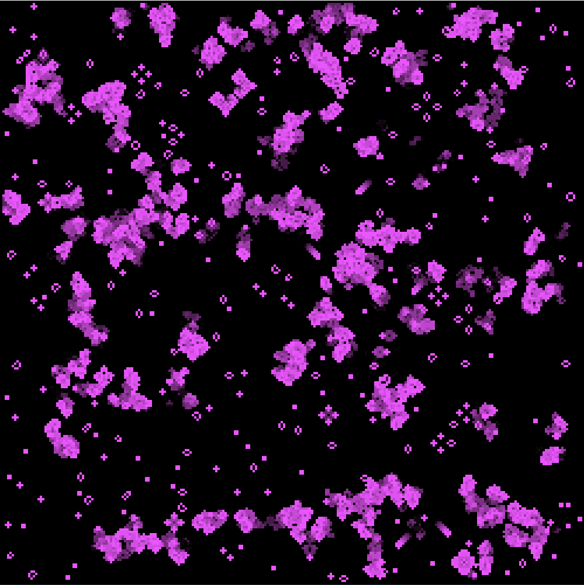

# Conway's Game of Life (Cellular Automata)

This is an implementation of Conway's Game of Life in C++ using SDL2.0 to display the grid.
One can add or remove cells from the simulation by pressing the left and right mousekeys. To start the simulation press any keyboard key and press again to stop it.

# Usage and Installation

Download the repo and run `make`. Then execute the program using `.\cellauto.exe` and start the simulation by pressing any key.